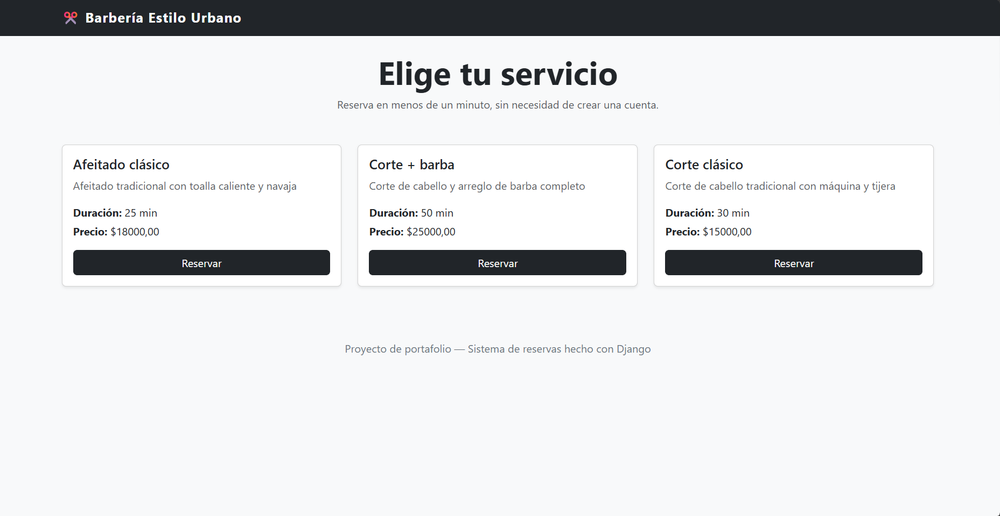
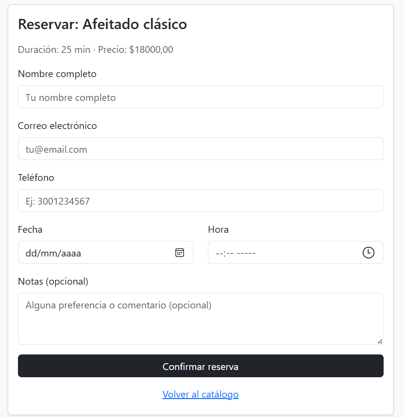
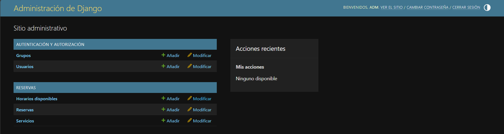

# Sistema de Reservas — Barbería (Proyecto de portafolio)

Aplicación web para gestionar reservas de citas en un negocio de servicios (ejemplo: barbería), construida con **Django, Bootstrap 5 y SQLite**.

## Funcionalidades

**Para el cliente:**
- Ver catálogo de servicios (nombre, duración, precio)
- Reservar un horario sin necesidad de crear cuenta
- Recibir confirmación de la reserva

**Para el administrador del negocio:**
- Panel de administración de Django para gestionar servicios
- Panel de reservas con filtro por estado (pendiente / confirmada / cancelada)
- Validación automática para evitar reservas duplicadas o solapadas en el mismo horario

## Detalle técnico destacado

La lógica más importante del proyecto es la validación de disponibilidad: antes de guardar una reserva, el sistema calcula el rango de horario que ocuparía (según la duración del servicio) y verifica que no se solape con ninguna reserva existente para ese mismo servicio. Esto evita que dos clientes reserven el mismo turno por error.

Ver: `reservas/models.py` → método `Reserva.existe_conflicto()`

## Stack

- Python 3.12
- Django 6.0
- Bootstrap 5 (vía CDN)
- SQLite (base de datos de desarrollo)

## Instalación local

```bash
# Clonar el repositorio
git clone <url-del-repo>
cd reservas-barberia

# Crear entorno virtual
python -m venv venv
source venv/bin/activate  # En Windows: venv\Scripts\activate

# Instalar dependencias
pip install -r requirements.txt

# Aplicar migraciones
python manage.py migrate

# Cargar servicios de ejemplo
python manage.py cargar_datos_ejemplo

# Crear usuario administrador
python manage.py createsuperuser

# Correr el servidor
python manage.py runserver
```

Luego abre:
- `http://127.0.0.1:8000/` → catálogo de servicios (vista pública)
- `http://127.0.0.1:8000/admin/` → panel de administración de Django
- `http://127.0.0.1:8000/panel/` → panel de reservas (requiere login)

## Estructura del proyecto

```
reservas-barberia/
├── reservas_project/      # Configuración del proyecto Django
├── reservas/               # App principal
│   ├── models.py           # Servicio, HorarioDisponible, Reserva
│   ├── views.py             # Lógica de catálogo, reserva y panel
│   ├── forms.py             # Formulario de reserva
│   ├── admin.py             # Configuración del panel admin
│   ├── urls.py               # Rutas de la app
│   └── templates/reservas/  # Templates con Bootstrap 5
└── requirements.txt
```

## Posibles mejoras futuras

- Envío de email de confirmación al cliente
- Calendario visual interactivo (FullCalendar.js)
- Autenticación de clientes para ver su historial de reservas
- Recordatorios automáticos por WhatsApp/SMS

---
*Proyecto desarrollado como parte de portafolio freelance.*

## Capturas de pantalla

**Catálogo de servicios**


**Formulario de reserva**


**Panel de administración**
